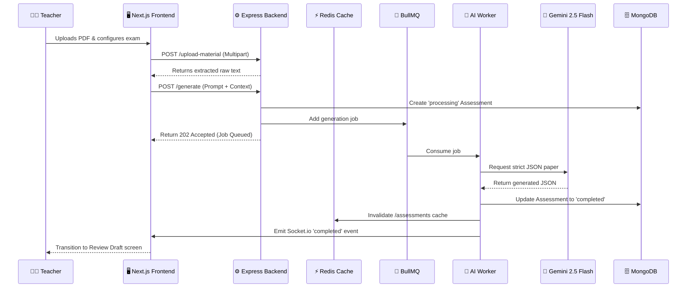

# VedaAI - AI Assessment Creator 🚀

Welcome to **VedaAI**, a state-of-the-art AI Assessment Creator designed to empower teachers by effortlessly generating highly structured, curriculum-aligned exam papers using generative AI.

---

## ✨ Features Implemented

### 🟢 Core Features
- **Interactive Form Wizard**: A beautiful, multi-step React frontend built with Next.js, allowing teachers to configure subject, questions, marks, and drop source materials.
- **Robust State Management**: Powered by **Zustand** with persistent storage.
- **AI Question Generation**: Uses Gemini 2.5 Flash to generate complex questions (with varying difficulties) in a strict, fully-typed JSON schema format.
- **Microservice Backend**: A Node.js + Express backend written in TypeScript.
- **Background Processing**: Uses **BullMQ + Redis** to handle heavy AI generation jobs asynchronously, ensuring the server never blocks.
- **Real-Time WebSockets**: Frontend is instantly notified via `Socket.io` the exact millisecond the AI generation finishes.

### 🌟 Bonus & "High Signal" Features 
- **High-Quality PDF Export**: Teachers can download the final assessment as a perfectly formatted A4 PDF using `html2pdf.js`.
- **Real File Upload & Parsing**: Teachers can drag-and-drop a **PDF or Text file** into the dashboard. The backend utilizes `pdf-parse` to extract the text and feeds it directly into the AI context window, generating questions *strictly based on the uploaded material*.
- **API Redis Caching**: Custom caching middleware automatically caches assignment history in Redis, resulting in `<20ms` response times.
- **Premium UI Polish**: The frontend has been massively upgraded with Glassmorphism (blurred backgrounds), Micro-animations, and animated Toast Notifications using `react-hot-toast`.
- **Review Draft Workflow**: A custom "Review Step" that allows teachers to intercept the AI's output and manually edit the questions/marks before publishing.

---

## 🏗️ System Architecture

VedaAI follows a modern, highly scalable microservice-inspired architecture designed to handle heavy AI workloads without blocking the main event loop.



### 🧩 Component Breakdown

1. **Client Layer (Next.js + Zustand)**
   - The frontend acts as an SPA (Single Page Application). It manages global state (like active viewing modes and user profiles) via `Zustand` with `persist` middleware.
   - It communicates with the backend via REST for fetching data and uses `Socket.io` to listen for real-time background task completions.

2. **API Layer (Node.js + Express)**
   - **Upload Service**: Uses `multer` in-memory storage to intercept PDF uploads. It streams the buffer into `pdf-parse` to extract text context before AI generation.
   - **Caching Middleware**: Uses `ioredis` to aggressively cache the `/api/assessments` history route. This guarantees `<20ms` response times for dashboard loads. Caches are instantly invalidated upon any mutation (POST/PUT/DELETE).

3. **Message Broker & Background Workers (BullMQ + Redis)**
   - AI generation requests can take 5-15 seconds. Instead of keeping the HTTP request alive, the API immediately responds with a `202 Accepted` and pushes the job to a Redis-backed BullMQ queue.
   - A dedicated Node.js Worker continually pulls jobs off the queue, processes them, and handles AI retries/failures independently of the main API server.

4. **AI Processing Engine (Google Gemini 2.5 Flash)**
   - The worker constructs a highly strict, schema-enforced prompt demanding `application/json` output. It dynamically injects the `materialContext` extracted from the teacher's PDF to ground the generation.

5. **Persistence Layer (MongoDB)**
   - Stores the final generated exam schemas, metadata (Due Dates, Topics), and keeps track of job states (`processing`, `completed`, `failed`).

---

## 🛠️ Setup & Installation

### Prerequisites
- Node.js (v18+)
- MongoDB running locally or a MongoDB Atlas URI.
- Redis running locally (`redis://localhost:6379`).

### 1. Clone & Install
```bash
git clone https://github.com/swatishah946/VedaAI-AI-Asssessment-Creator.git
cd VedaAI-AI-Asssessment-Creator

# Install backend dependencies
cd backend
npm install

# Install frontend dependencies
cd ../frontend
npm install
```

### 2. Environment Variables
Create a `.env` file in the **`backend`** directory:
```env
PORT=5000
MONGODB_URI=mongodb://localhost:27017/vedaai
REDIS_URI=redis://localhost:6379
FRONTEND_URL=http://localhost:3000
GEMINI_API_KEY=your_gemini_api_key_here
```

Create a `.env.local` file in the **`frontend`** directory:
```env
NEXT_PUBLIC_API_URL=http://localhost:5000
```

### 3. Run the Application
You need to run both the frontend and backend servers simultaneously.

**Terminal 1 (Backend):**
```bash
cd backend
npm run dev
```

**Terminal 2 (Frontend):**
```bash
cd frontend
npm run dev
```

Visit `http://localhost:3000` to access the platform!
